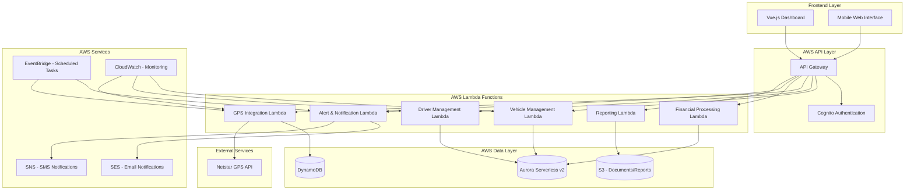

# FLEET System Architecture

## Overview

FLEET (Fleet Location, Efficiency, and Tracking Technology) is a comprehensive serverless vehicle and driver management system built on AWS. The system follows a modern microservices architecture with clear separation between frontend, API, business logic, and data layers.

## System Architecture Diagram

## Architecture Layers

### 🌐 **Frontend Layer**
- **Vue.js Dashboard**: Primary web interface for fleet management
- **Mobile Web Interface**: Responsive design for mobile access
- **Hosting**: S3 + CloudFront for global content delivery
- **Deployment**: Separate infrastructure stack for independent scaling

### 🔌 **API Layer**
- **API Gateway**: RESTful API endpoints with CORS support
- **Cognito Authentication**: User management and JWT token validation
- **Rate Limiting**: Built-in throttling and request validation
- **Logging**: CloudWatch access logs and X-Ray tracing

### ⚡ **Business Logic Layer (Lambda Functions)**
- **Vehicle Management**: CRUD operations, maintenance tracking, cost analysis
- **Driver Management**: Onboarding, assignments, performance tracking
- **GPS Integration**: Real-time tracking, behavior monitoring via Netstar API
- **Financial Processing**: Weekly settlements, payment tracking, reporting
- **Alert & Notification**: Performance alerts, maintenance reminders via SES/SNS
- **Reporting**: PDF generation, analytics, cost reports stored in S3

### 💾 **Data Layer**
- **Aurora Serverless v2**: PostgreSQL for relational data (vehicles, drivers, finances)
- **DynamoDB**: Time-series GPS data with TTL for automatic cleanup
- **S3**: Document storage, reports, and static website hosting

### 🔧 **Supporting Services**
- **EventBridge**: Scheduled tasks (GPS sync, alert processing, settlements)
- **SES**: Email notifications for alerts and reports
- **SNS**: SMS notifications for critical alerts
- **CloudWatch**: Comprehensive logging, monitoring, and alarms

### 🌍 **External Integrations**
- **Netstar GPS API**: Real-time vehicle tracking and behavior monitoring
- **Future Integrations**: Uber API, payment processors, insurance providers

## Key Architectural Principles

### **Serverless-First**
- No server management or infrastructure provisioning
- Automatic scaling based on demand
- Pay-per-use pricing model
- Built-in high availability and fault tolerance

### **Microservices Architecture**
- Each Lambda function handles a specific business domain
- Independent deployment and scaling
- Clear separation of concerns
- Fault isolation between services

### **Event-Driven Design**
- EventBridge for scheduled and event-based processing
- Asynchronous communication between services
- Decoupled architecture for better resilience

### **Security by Design**
- API Gateway with Cognito authentication
- IAM roles with least privilege access
- Encryption at rest and in transit
- VPC-free architecture for simplified security

### **Observability**
- CloudWatch for centralized logging
- X-Ray for distributed tracing
- Custom metrics for business KPIs
- Automated alerting for system health

## Deployment Architecture

### **Infrastructure as Code**
- **Backend**: `template.yaml` (SAM/CloudFormation)
- **Frontend**: `frontend-template.yaml` (separate stack)
- **Environment Separation**: Independent dev/prod deployments
- **CI/CD Ready**: Automated deployment scripts

### **Environment Strategy**
- **Development**: `fleet-system-dev` + `fleet-frontend-dev`
- **Production**: `fleet-system-prod` + `fleet-frontend-prod`
- **Region**: AWS Ireland (eu-west-1) for all resources
- **Naming**: Consistent resource naming with environment suffixes

## Data Flow Examples

### **Vehicle Registration Flow**
1. User submits vehicle form via frontend
2. API Gateway validates request and routes to Vehicle Lambda
3. Vehicle Lambda validates data and stores in Aurora
4. Response returns to frontend with success/error status
5. Frontend updates vehicle list in real-time

### **GPS Tracking Flow**
1. EventBridge triggers GPS Lambda every 5 minutes
2. GPS Lambda calls Netstar API for latest vehicle positions
3. GPS data stored in DynamoDB with TTL for cleanup
4. Speed violations trigger alerts via Alert Lambda
5. Notifications sent via SES/SNS to relevant users

### **Weekly Settlement Flow**
1. EventBridge triggers Financial Lambda weekly
2. Lambda aggregates card payments and cash trips from Aurora
3. Settlement calculations performed (R5000 minimum deduction)
4. PDF reports generated and stored in S3
5. Email notifications sent to drivers and operators

This architecture provides a scalable, maintainable, and cost-effective solution for comprehensive fleet management operations.