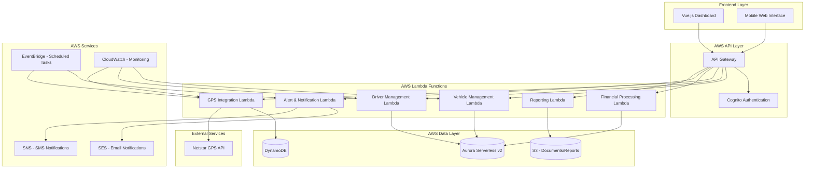

# Design Document: FLEET (Fleet Location, Efficiency, and Tracking Technology) 

## Overview

Fleet - Fleet Location, Efficiency, and Tracking Technology - is a vehicle and driver management system is a comprehensive web-based application designed to manage Uber rental fleet operations. The system integrates vehicle tracking, driver performance monitoring, financial settlements, maintenance tracking, and insurance management into a unified platform.

The system follows a modern serverless architecture using AWS services deployed in the Ireland region (eu-west-1) with a Python Lambda backend, Vue.js frontend, and serverless database. It integrates with external services including the Netstar GPS API for vehicle tracking and supports both automated and manual data entry workflows.

## Architecture

### System Architecture



### Technology Stack

- **Region**: AWS Ireland (eu-west-1) for all services
- **Frontend**: Vue.js 3 with TypeScript, Pinia for state management, Vue Router
- **Deployment**: AWS Amplify for frontend hosting and CI/CD
- **API Layer**: AWS API Gateway with Lambda integration
- **Backend**: Python 3.11 on AWS Lambda with boto3 for AWS service integration
- **Authentication**: AWS Cognito for user management and JWT tokens
- **Database**: Aurora Serverless v2 (PostgreSQL) for relational data, DynamoDB for GPS/time-series data
- **Caching**: DynamoDB with TTL for GPS data management
- **Infrastructure**: AWS SAM (Serverless Application Model) for backend deployment
- **Monitoring**: CloudWatch for logging, metrics, and alarms
- **Notifications**: SES for email, SNS for SMS alerts
- **Scheduling**: EventBridge for cron-like scheduled tasks
- **Storage**: S3 for document storage and report generation

## Components and Interfaces

### Core Components

#### 1. Vehicle Management Lambda
- **Purpose**: Manages vehicle inventory, maintenance scheduling, and service records
- **Runtime**: Python 3.11 on AWS Lambda
- **Key Functions**:
  - Vehicle registration and profile management
  - Service scheduling and maintenance alerts
  - Cost tracking per vehicle and maintenance type
  - Service history with driver correlation
- **Database**: Aurora Serverless v2 for relational vehicle data

#### 2. Driver Management Lambda
- **Purpose**: Handles driver onboarding, assignments, and performance tracking
- **Runtime**: Python 3.11 on AWS Lambda
- **Key Functions**:
  - Driver registration and document validation
  - Vehicle assignment management
  - Performance metrics calculation
  - Target achievement tracking
- **Database**: Aurora Serverless v2 for driver profiles and assignments

#### 3. Financial Settlement Lambda
- **Purpose**: Processes weekly settlements between operator and drivers
- **Runtime**: Python 3.11 on AWS Lambda
- **Key Functions**:
  - Card payment tracking from Uber
  - Cash trip recording and monitoring
  - R5000 minimum deduction calculation
  - Settlement report generation
- **Database**: Aurora Serverless v2 for financial records

#### 4. GPS Tracking Lambda
- **Purpose**: Integrates with Netstar API for real-time vehicle monitoring
- **Runtime**: Python 3.11 on AWS Lambda
- **Key Functions**:
  - Real-time location tracking
  - Speed violation detection
  - Harsh driving event monitoring
  - Route history and analytics
- **Database**: DynamoDB for time-series GPS data, Aurora Serverless v2 for relational data

#### 5. Alert & Notification Lambda
- **Purpose**: Manages system alerts and notifications
- **Runtime**: Python 3.11 on AWS Lambda
- **Key Functions**:
  - Performance alert generation
  - Maintenance reminder notifications
  - Insurance renewal alerts
  - SMS and email delivery via SNS/SES
- **Triggers**: EventBridge scheduled rules, direct Lambda invocations

#### 6. Reporting Lambda
- **Purpose**: Generates comprehensive reports and analytics
- **Runtime**: Python 3.11 on AWS Lambda
- **Key Functions**:
  - Weekly settlement reports
  - Fleet performance analytics
  - Cost analysis reports
  - PDF generation and S3 storage
- **Storage**: S3 for report files and document storage

### API Interfaces

#### Vehicle API (API Gateway + Lambda)
```python
# Lambda function handler signatures
def create_vehicle(event, context):
    """Create new vehicle record"""
    pass

def get_vehicle(event, context):
    """Retrieve vehicle by ID"""
    pass

def update_vehicle(event, context):
    """Update vehicle information"""
    pass

def add_service_record(event, context):
    """Add service record to vehicle"""
    pass

def get_service_history(event, context):
    """Get complete service history"""
    pass

def get_maintenance_alerts(event, context):
    """Get pending maintenance alerts"""
    pass

def get_service_costs(event, context):
    """Get service cost analysis"""
    pass
```

#### Driver API (API Gateway + Lambda)
```python
def create_driver(event, context):
    """Create new driver profile"""
    pass

def get_driver(event, context):
    """Retrieve driver by ID"""
    pass

def update_driver(event, context):
    """Update driver information"""
    pass

def assign_vehicle(event, context):
    """Assign vehicle to driver"""
    pass

def get_driver_assignments(event, context):
    """Get driver's vehicle assignments"""
    pass

def get_driver_performance(event, context):
    """Get driver performance metrics"""
    pass
```

#### Financial API (API Gateway + Lambda)
```python
def record_card_payment(event, context):
    """Record Uber card payment"""
    pass

def record_cash_trip(event, context):
    """Record cash trip for tracking"""
    pass

def calculate_weekly_settlement(event, context):
    """Calculate driver's weekly settlement"""
    pass

def generate_settlement_report(event, context):
    """Generate settlement report PDF"""
    pass

def get_earnings_report(event, context):
    """Get earnings analysis report"""
    pass
```

#### GPS API (API Gateway + Lambda)
```python
def get_vehicle_location(event, context):
    """Get real-time vehicle location"""
    pass

def get_location_history(event, context):
    """Get historical location data"""
    pass

def get_driving_events(event, context):
    """Get harsh driving events"""
    pass

def get_speed_violations(event, context):
    """Get speed violation history"""
    pass

def sync_netstar_data(event, context):
    """Scheduled sync with Netstar API"""
    pass
```

## Data Models

### Core Entities

#### Vehicle Entity (Aurora Serverless)
```python
from dataclasses import dataclass
from datetime import datetime
from enum import Enum
from typing import Optional, List

class VehicleStatus(Enum):
    ACTIVE = 'active'
    IN_SERVICE = 'in_service'
    OUT_OF_ORDER = 'out_of_order'
    RETIRED = 'retired'

@dataclass
class Vehicle:
    id: str
    make: str
    model: str
    year: int
    registration: str
    vin: Optional[str]
    status: VehicleStatus
    current_driver_id: Optional[str]
    created_at: datetime
    updated_at: datetime
    
    # Relationships loaded separately
    service_records: Optional[List['ServiceRecord']] = None
    assignments: Optional[List['DriverAssignment']] = None
    insurance_policy: Optional['InsurancePolicy'] = None
    gps_device: Optional['GPSDevice'] = None
```

#### Driver Entity (Aurora Serverless)
```python
class DriverStatus(Enum):
    ACTIVE = 'active'
    INACTIVE = 'inactive'
    SUSPENDED = 'suspended'
    TERMINATED = 'terminated'

@dataclass
class Driver:
    id: str
    first_name: str
    last_name: str
    email: str
    phone: str
    license_number: str
    license_expiry: datetime
    id_number: str
    address: dict  # JSON field
    status: DriverStatus
    created_at: datetime
    updated_at: datetime
    
    # Relationships loaded separately
    assignments: Optional[List['DriverAssignment']] = None
    payments: Optional[List['Payment']] = None
    performance_records: Optional[List['PerformanceRecord']] = None
```

#### Service Record Entity (Aurora Serverless)
```python
class MaintenanceType(Enum):
    OIL_CHANGE = 'oil_change'
    BRAKE_SERVICE = 'brake_service'
    TIRE_REPLACEMENT = 'tire_replacement'
    ENGINE_REPAIR = 'engine_repair'
    TRANSMISSION_SERVICE = 'transmission_service'
    ACCIDENT_REPAIR = 'accident_repair'
    GENERAL_MAINTENANCE = 'general_maintenance'

@dataclass
class ServiceRecord:
    id: str
    vehicle_id: str
    driver_id: Optional[str]
    service_type: MaintenanceType
    description: str
    cost: float
    service_date: datetime
    mileage: int
    service_provider: str
    is_warranty: bool
    next_service_due: Optional[datetime]
    created_at: datetime
```

#### Financial Settlement Entity (Aurora Serverless)
```python
class SettlementStatus(Enum):
    PENDING = 'pending'
    PROCESSED = 'processed'
    DISPUTED = 'disputed'

@dataclass
class WeeklySettlement:
    id: str
    driver_id: str
    vehicle_id: str
    week_start_date: datetime
    week_end_date: datetime
    
    # Earnings breakdown
    card_earnings: float
    cash_trip_value: float
    total_earnings: float
    
    # Settlement calculation
    minimum_deduction: float  # R5000
    driver_payout: float
    shortfall: float
    
    # Trip statistics
    total_trips: int
    card_trips: int
    cash_trips: int
    cash_trip_percentage: float
    
    status: SettlementStatus
    processed_at: Optional[datetime]
    created_at: datetime
```

#### GPS Data Entity (DynamoDB)
```python
@dataclass
class GPSData:
    # DynamoDB partition key: vehicle_id
    # DynamoDB sort key: timestamp
    vehicle_id: str
    timestamp: datetime
    latitude: float
    longitude: float
    speed: float
    heading: float
    altitude: Optional[float]
    accuracy: float
    
    # Calculated fields
    is_speed_violation: bool
    speed_limit: Optional[float]
    
    # TTL for automatic cleanup (30 days)
    ttl: int

@dataclass
class DrivingEvent:
    # DynamoDB partition key: vehicle_id
    # DynamoDB sort key: timestamp
    vehicle_id: str
    timestamp: datetime
    driver_id: Optional[str]
    event_type: str  # harsh_braking, harsh_acceleration, etc.
    location: dict   # {"lat": float, "lng": float}
    severity: str    # low, medium, high, critical
    speed: float
    g_force: Optional[float]
    description: str
    
    # TTL for automatic cleanup (90 days)
    ttl: int
```

### Netstar API Integration

#### Netstar Data Models
```python
@dataclass
class NetstarVehicleData:
    vehicle_id: str
    device_id: str
    timestamp: str
    position: dict  # {"latitude": float, "longitude": float, "altitude": float, "accuracy": float}
    motion: dict    # {"speed": float, "heading": float, "acceleration": float}
    events: List[dict]  # List of NetstarEvent dictionaries
    status: dict    # {"ignition": bool, "battery": int, "signal": int}

@dataclass
class NetstarEvent:
    type: str
    timestamp: str
    severity: str
    location: dict  # {"lat": float, "lng": float}
    metadata: dict  # Additional event-specific data
```

### AWS Infrastructure Components

#### Lambda Function Configuration
```yaml
# SAM template.yaml structure
Resources:
  VehicleManagementFunction:
    Type: AWS::Serverless::Function
    Properties:
      Runtime: python3.11
      Handler: vehicle_handler.lambda_handler
      Environment:
        Variables:
          AURORA_CLUSTER_ARN: !Ref AuroraCluster
          DATABASE_NAME: vehicle_management
      Events:
        VehicleAPI:
          Type: Api
          Properties:
            Path: /vehicles/{proxy+}
            Method: ANY

  GPSTrackingFunction:
    Type: AWS::Serverless::Function
    Properties:
      Runtime: python3.11
      Handler: gps_handler.lambda_handler
      Environment:
        Variables:
          DYNAMODB_TABLE: !Ref GPSDataTable
      Events:
        ScheduledSync:
          Type: Schedule
          Properties:
            Schedule: rate(5 minutes)
```

#### Database Configuration
```yaml
# Aurora Serverless v2 for relational data
AuroraCluster:
  Type: AWS::RDS::DBCluster
  Properties:
    Engine: aurora-postgresql
    EngineMode: provisioned
    ServerlessV2ScalingConfiguration:
      MinCapacity: 0.5
      MaxCapacity: 16
    DatabaseName: vehicle_management

# DynamoDB for GPS time-series data
GPSDataTable:
  Type: AWS::DynamoDB::Table
  Properties:
    BillingMode: ON_DEMAND
    AttributeDefinitions:
      - AttributeName: vehicle_id
        AttributeType: S
      - AttributeName: timestamp
        AttributeType: S
    KeySchema:
      - AttributeName: vehicle_id
        KeyType: HASH
      - AttributeName: timestamp
        KeyType: RANGE
    TimeToLiveSpecification:
      AttributeName: ttl
      Enabled: true
```

## Correctness Properties

*A property is a characteristic or behavior that should hold true across all valid executions of a system-essentially, a formal statement about what the system should do. Properties serve as the bridge between human-readable specifications and machine-verifiable correctness guarantees.*

<function_calls>
<invoke name="prework">
<parameter name="featureName">vehicle-driver-management

### Property Reflection

After analyzing all acceptance criteria, I identified several areas where properties can be consolidated to eliminate redundancy:

1. **Data Storage Properties**: Multiple criteria test basic CRUD operations - these can be combined into comprehensive data integrity properties
2. **Cost Calculation Properties**: Several properties test different aspects of cost calculation - these can be unified into comprehensive cost calculation properties  
3. **Alert Generation Properties**: Multiple threshold-based alerts can be combined into a general alerting property
4. **Report Generation Properties**: Various reporting requirements can be consolidated into comprehensive reporting properties

### Core Correctness Properties

Property 1: **Vehicle Data Integrity**
*For any* vehicle record with complete details (make, model, year, registration, status), storing and retrieving the vehicle should preserve all field values exactly
**Validates: Requirements 1.1**

Property 2: **Service Record Completeness**
*For any* service event, recording service details should capture all required fields (type, cost, date, assigned driver) and maintain the complete service history
**Validates: Requirements 1.2, 1.5**

Property 3: **Usage Metrics Monotonicity**
*For any* vehicle, usage metrics (mileage and operational hours) should only increase over time and never decrease
**Validates: Requirements 1.3**

Property 4: **Maintenance Alert Generation**
*For any* vehicle with defined service intervals, when mileage or time thresholds are reached, maintenance alerts should be generated
**Validates: Requirements 1.4**

Property 5: **Cost Threshold Alerting**
*For any* vehicle, when service costs exceed the fleet average by 20% or more, high maintenance cost alerts should be generated
**Validates: Requirements 1.8**

Property 6: **Driver Data Integrity**
*For any* driver record with complete information, storing and retrieving the driver should preserve all personal details, license information, and contact details exactly
**Validates: Requirements 2.1**

Property 7: **Driver License Validation**
*For any* invalid driver license data (expired, malformed, or missing), the system should reject the driver onboarding attempt
**Validates: Requirements 2.2**

Property 8: **Vehicle Assignment Consistency**
*For any* vehicle assignment change, the system should update both vehicle availability and driver status consistently, preventing double assignments
**Validates: Requirements 2.3, 2.5**

Property 9: **Performance History Persistence**
*For any* driver performance record, the historical data should be maintained over time and never lost or corrupted
**Validates: Requirements 2.4**

Property 10: **Weekly Settlement Calculation**
*For any* driver with weekly earnings data, the settlement calculation should correctly deduct R5000 from card earnings only and calculate driver payout as the excess
**Validates: Requirements 3.1, 3.4, 3.5**

Property 11: **Earnings Aggregation Accuracy**
*For any* combination of card payments and cash trips, the total weekly earnings should equal the sum of both components
**Validates: Requirements 3.2, 3.3**

Property 12: **Shortfall Tracking**
*For any* week where total earnings (card + cash) are less than R5000, the system should record the exact shortfall amount that the driver owes
**Validates: Requirements 3.6**

Property 13: **Settlement Report Completeness**
*For any* weekly settlement, the generated report should contain all required fields: card earnings, cash trips, total earnings, deductions, and final settlement amount
**Validates: Requirements 3.7**

Property 14: **GPS Data Integration**
*For any* valid Netstar API response, the system should correctly parse and extract location, speed, and behavior data
**Validates: Requirements 4.1, 7.3**

Property 15: **Speed Violation Detection**
*For any* GPS data where vehicle speed exceeds defined safe limits, speed violation alerts should be generated
**Validates: Requirements 4.2**

Property 16: **Harsh Driving Event Recording**
*For any* GPS data indicating excessive braking, harsh acceleration, or rapid cornering, the system should record the driving incident with appropriate severity
**Validates: Requirements 4.3**

Property 17: **Location History Persistence**
*For any* vehicle GPS data, the location history should be maintained accurately and be retrievable for analysis
**Validates: Requirements 4.4, 7.4**

Property 18: **Insurance Premium Tracking**
*For any* vehicle, the system should track exactly R500 monthly insurance premiums and generate accurate cost reports
**Validates: Requirements 5.1, 5.6, 5.7**

Property 19: **Insurance Renewal Alerting**
*For any* insurance policy expiring within 30 days, renewal alerts should be generated at the appropriate time
**Validates: Requirements 5.2**

Property 20: **Claims Status Tracking**
*For any* insurance claim, the system should maintain accurate status updates and claim details throughout the claim lifecycle
**Validates: Requirements 5.3, 5.5**

Property 21: **Performance Target Monitoring**
*For any* driver, weekly earnings should be accurately tracked against the R5000 minimum target including both card and cash trips
**Validates: Requirements 6.1**

Property 22: **Performance Alert Generation**
*For any* driver failing to meet weekly targets, performance alerts should be generated
**Validates: Requirements 6.2**

Property 23: **Performance Metrics Calculation**
*For any* driver with historical earnings data, performance metrics (target achievement rate, average weekly earnings) should be calculated correctly
**Validates: Requirements 6.3, 6.4**

Property 24: **Consecutive Performance Tracking**
*For any* driver, the system should accurately count consecutive weeks of target achievement or failure
**Validates: Requirements 6.5**

Property 25: **Cash Trip Percentage Monitoring**
*For any* driver with weekly trip data, when cash trips exceed 70% of total trips, excessive cash trip alerts should be generated
**Validates: Requirements 6.6**

Property 26: **Cash-to-Card Ratio Calculation**
*For any* driver's weekly trip data, the cash-to-card ratio should be calculated correctly from the trip counts
**Validates: Requirements 6.7**

Property 27: **API Error Handling**
*For any* Netstar API error or rate limit response, the system should handle it gracefully and continue operating with cached data
**Validates: Requirements 7.2, 7.5**

Property 28: **Netstar Cost Tracking**
*For any* vehicle, the system should track exactly R200 monthly Netstar subscription costs and generate accurate cost reports
**Validates: Requirements 7.6, 7.7**

Property 29: **Service Cost Categorization**
*For any* service record, costs should be properly categorized by maintenance type and correlated with the driver assigned at the time of service
**Validates: Requirements 8.1, 8.2**

Property 30: **Fleet Cost Comparison**
*For any* vehicle in the fleet, average service costs should be calculated correctly and compared accurately across all vehicles
**Validates: Requirements 8.3**

Property 31: **Maintenance Pattern Detection**
*For any* vehicle with recurring maintenance of the same type, pattern alerts should be generated when frequency exceeds normal thresholds
**Validates: Requirements 8.4**

Property 32: **Cost Separation**
*For any* repair cost, accident repairs should be tracked separately from routine maintenance costs in all calculations and reports
**Validates: Requirements 8.6**

Property 33: **Total Cost of Ownership**
*For any* vehicle, the total cost of ownership should accurately include all cost components: insurance (R500/month), GPS (R200/month), maintenance, and repairs
**Validates: Requirements 8.7**

Property 34: **Data Encryption**
*For any* sensitive data (driver personal information, financial records), the data should be properly encrypted when stored
**Validates: Requirements 9.1**

Property 35: **Role-Based Access Control**
*For any* user with a specific role, they should only be able to access data and functions appropriate to their assigned role
**Validates: Requirements 9.2**

Property 36: **Audit Logging**
*For any* system access or data modification, an audit log entry should be created with complete details
**Validates: Requirements 9.3**

Property 37: **Automated Backup**
*For any* day, an automated backup should be created containing all system data
**Validates: Requirements 9.4**

## Error Handling

### API Error Handling
- **Netstar API Failures**: Implement exponential backoff retry logic with circuit breaker pattern
- **Database Connection Issues**: Use connection pooling with automatic reconnection
- **Validation Errors**: Return structured error responses with field-specific messages
- **Authentication Failures**: Implement secure session management with automatic token refresh

### Deployment Error Handling
- **SAM Deployment Failures**: When `sam deploy` fails with `AWS::EarlyValidation::ResourceExistenceCheck` errors, use `aws cloudformation describe-change-set` to find the specific validation error and identify conflicting resources
- **Resource Conflicts**: Common causes include existing CloudWatch Log Groups, Lambda functions, or other AWS resources with the same names from previous deployments
- **Log Group Naming**: Use datetime-based random suffixes (e.g., `20260106081500`) in CloudWatch Log Group names to prevent conflicts from previous deployments
- **Stack Rollback States**: If a stack is in `UPDATE_ROLLBACK_COMPLETE` state, identify and resolve the underlying resource conflicts before attempting redeployment
- **Log Group Cleanup**: Manually delete conflicting CloudWatch Log Groups using `aws logs delete-log-group` when they prevent stack updates

### Data Consistency
- **Transaction Management**: Use database transactions for multi-table operations
- **Concurrent Access**: Implement optimistic locking for vehicle assignments
- **Data Validation**: Server-side validation for all input data with sanitization
- **Backup and Recovery**: Automated daily backups with point-in-time recovery capability

### System Resilience
- **Service Degradation**: Graceful degradation when external services are unavailable
- **Rate Limiting**: Implement rate limiting for API endpoints to prevent abuse
- **Monitoring and Alerting**: Comprehensive logging and monitoring with automated alerts
- **Failover Mechanisms**: Database replication and automatic failover for high availability

## Testing Strategy

### Mandatory Testing Requirements
Every feature implementation MUST include comprehensive test coverage:

#### Test Coverage Requirements
1. **Unit Tests**: Minimum 80% code coverage for all Lambda functions
2. **Property-Based Tests**: Every correctness property must have corresponding tests
3. **Integration Tests**: All API endpoints and database operations
4. **Error Handling Tests**: All failure scenarios and edge cases

### Dual Testing Approach
The system will use both unit testing and property-based testing to ensure comprehensive coverage:

- **Unit Tests**: Verify specific examples, edge cases, and error conditions
- **Property Tests**: Verify universal properties across all inputs using randomized test data
- Both approaches are complementary and necessary for complete validation

### Property-Based Testing Configuration
- **Testing Framework**: Use `Hypothesis` for Python property-based testing
- **Test Iterations**: Minimum 100 iterations per property test to ensure thorough coverage
- **Test Tagging**: Each property test tagged with format: **Feature: vehicle-driver-management, Property {number}: {property_text}**
- **Property Implementation**: Each correctness property implemented as a single property-based test

### Unit Testing Focus Areas
- **API Endpoint Testing**: Test all REST endpoints with various input scenarios
- **Database Integration**: Test data persistence and retrieval operations
- **External Service Integration**: Mock Netstar API responses and test integration logic
- **Business Logic Validation**: Test financial calculations, alert generation, and reporting
- **Security Testing**: Test authentication, authorization, and data encryption
- **Error Handling**: Test error scenarios and system resilience

### Integration Testing
- **End-to-End Workflows**: Test complete user journeys from vehicle registration to settlement processing
- **External API Integration**: Test actual Netstar API integration in staging environment
- **Database Performance**: Test system performance under realistic data loads
- **Concurrent User Testing**: Test system behavior with multiple simultaneous users

### Testing Tools and Frameworks
- **Unit Testing**: pytest for Python Lambda function testing
- **Property Testing**: Hypothesis for property-based test generation in Python
- **Integration Testing**: Playwright for end-to-end browser testing
- **API Testing**: boto3 with moto for AWS service mocking
- **Database Testing**: pytest-postgresql for Aurora testing, moto for DynamoDB mocking
- **Lambda Testing**: AWS SAM CLI for local Lambda testing
- **Infrastructure Testing**: AWS CDK/SAM for infrastructure as code testing

### Test Implementation Requirements
Each feature must include:
1. **Unit test file**: `tests/unit/test_{feature_name}.py`
2. **Property test file**: `tests/property/test_{feature_name}_properties.py`
3. **Integration test file**: `tests/integration/test_{feature_name}_integration.py`
4. **Test fixtures**: Sample data and mock responses in `tests/fixtures/`
5. **Test documentation**: Clear test descriptions and expected behaviors